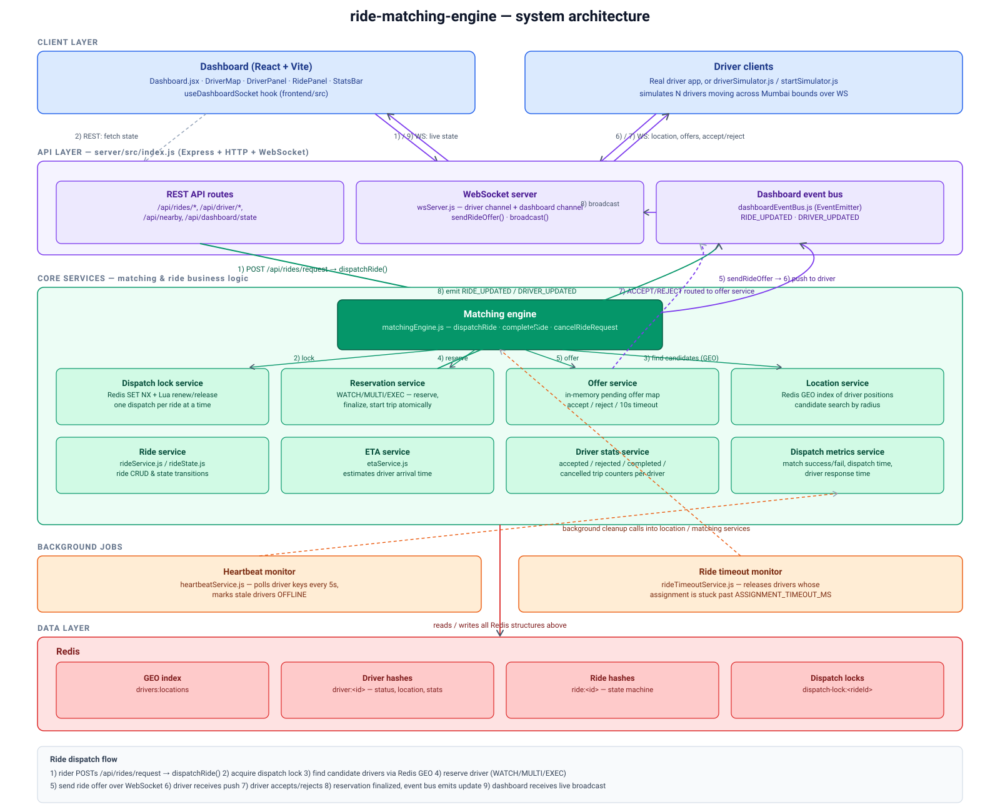
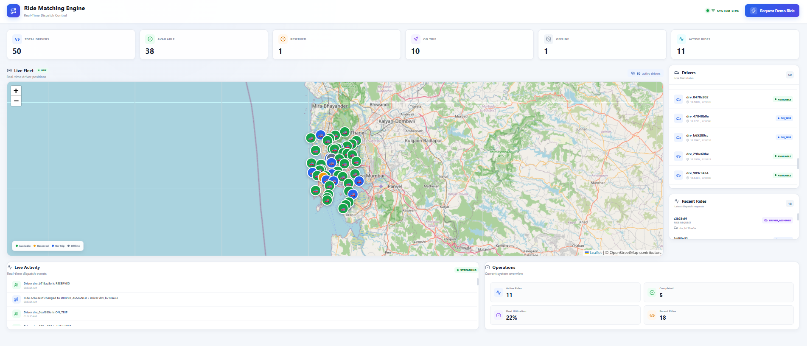
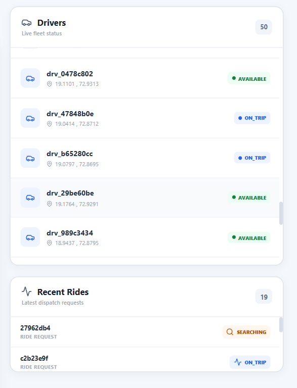
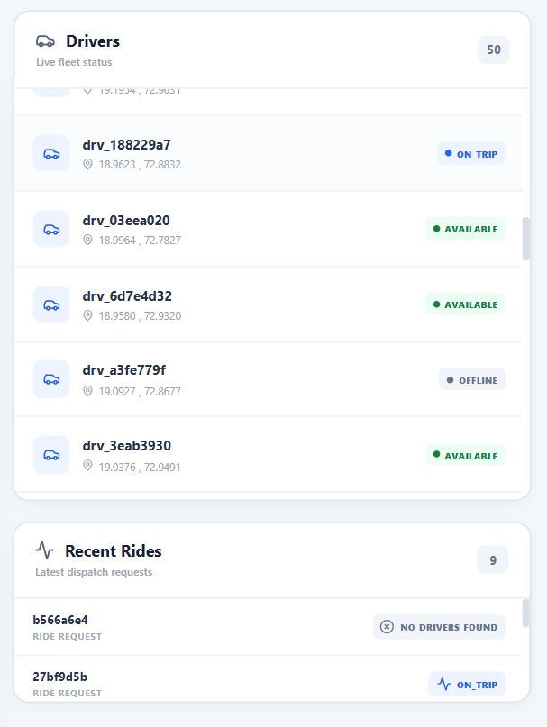
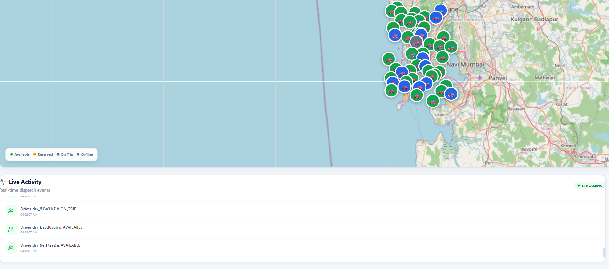

# Ride-matching-engine

A real-time ride dispatch system inspired by how ride-hailing apps match riders to nearby drivers. Built to explore the hard concurrency problems in dispatch: geo-indexed driver search, atomic driver reservation under contention, ride-offer timeouts, and a live dashboard fed by WebSocket events — all backed by Redis as the single source of truth.



## Table of contents

- [What it does](#what-it-does)
- [Screenshots](#screenshots)
- [Architecture](#architecture)
- [Design decisions](#design-decisions)
- [State machines](#state-machines)
- [Redis data model](#redis-data-model)
- [Tech stack](#tech-stack)
- [Project structure](#project-structure)
- [Getting started](#getting-started)
- [API reference](#api-reference)
- [WebSocket protocol](#websocket-protocol)
- [Concurrency testing](#concurrency-testing)


## What it does

- Riders request a ride with a pickup and drop location.
- The matching engine finds nearby available drivers using Redis' `GEO` commands, then reserves them one at a time using `WATCH`/`MULTI`/`EXEC` so two concurrent dispatches can never double-book the same driver.
- The reserved driver gets a ride offer pushed over WebSocket and has a short window to accept or reject. A reject or timeout moves on to the next candidate, up to 20 candidates per dispatch.
- A live dashboard shows every driver's position, status, and every ride's state as it changes — pushed in real time via an internal event bus and WebSocket broadcast, not polling.
- Background jobs quietly clean up after failures: a heartbeat monitor marks drivers offline if they stop reporting location, and a ride-timeout monitor releases drivers stuck in a bad assignment.
- A driver simulator spins up any number of fake drivers roaming a bounded area (Mumbai, by default) and auto-responds to offers, so the whole system can be exercised end-to-end without real driver apps.
- Dispatch metrics (match success/failure rate, average dispatch time, average driver response time) are tracked in Redis and exposed for the dashboard.

## Screenshots

**Dashboard overview**


| Ride dispatch — Searching | Ride dispatch — Other States |
|---|---|
|  |  |

**Live activity map**


## Architecture

See [`docs/architecture/architecture.svg`](docs/architecture/architecture.svg) for the full diagram. At a glance:

- **Client layer** — a React/Vite dashboard, and driver clients (real or simulated) connected over WebSocket.
- **API layer** (`server/src/index.js`) — an Express REST API, a WebSocket server for driver and dashboard channels, and an internal event bus that decouples state changes from the WebSocket broadcast.
- **Core services** (`server/src/matching`, `rides`, `location`, `drivers`, `eta`, `metrics`) — the matching engine orchestrates dispatch; dedicated services handle locking, atomic reservation, offer/response tracking, geo search, ride state, ETA, and metrics.
- **Background jobs** — heartbeat and ride-timeout monitors that keep driver and ride state consistent when clients disconnect or offers stall.
- **Data layer** — Redis holds the driver geo index, driver hashes, ride hashes, and short-lived dispatch locks.

**Dispatch flow, end to end:**

1. Rider `POST`s `/api/rides/request` → the ride is created in `SEARCHING` state → `dispatchRide()` runs.
2. A per-ride dispatch lock is acquired (`SET NX` with a TTL, renewed every 10s while dispatch is in progress) so a ride can't be dispatched twice concurrently.
3. Candidate drivers are found with a Redis `GEORADIUS` query around the pickup point, filtered to `AVAILABLE` drivers not already attempted for this ride.
4. The first candidate is reserved atomically (`WATCH`/`MULTI`/`EXEC` on the driver hash) — this is what prevents two simultaneous dispatches from grabbing the same driver.
5. A ride offer is pushed to that driver over WebSocket, and the matching engine awaits a response (accept, reject, or a 10s timeout).
6. On accept, the assignment is finalized atomically against both the driver and ride hashes; on reject/timeout/failure, the driver is released and the engine moves to the next candidate.
7. Every state change emits an event on the internal event bus, which the WebSocket layer broadcasts to all connected dashboard clients — so the dashboard reflects reality within milliseconds, not on a polling interval.

## Design decisions

**Why Redis `WATCH`/`MULTI`/`EXEC` instead of a single `HSET`?**
Reserving a driver is a check-then-act operation — read the driver's status, then flip it if and only if it's still `AVAILABLE`. Without optimistic locking, two dispatch calls racing for the same driver could both read `AVAILABLE` and both write a reservation, silently double-booking the driver. `WATCH` aborts the transaction if the key changed since it was read, and the code retries in a loop until it either wins cleanly or the driver is legitimately gone.

**Why a distributed dispatch lock in addition to driver-level locking?**
The driver reservation lock protects one driver; the dispatch lock protects one ride. It stops the same ride from being dispatched twice in parallel (e.g. a duplicate API call, or a retry racing the original request), which would otherwise send two separate offers out for the same ride.

**Why an in-memory `Map` for pending offers instead of Redis?**
An offer's lifecycle (send → await response → resolve a `Promise`) lives entirely within a single Node process and a single WebSocket connection, so keeping it in memory avoids a round trip and keeps the accept/reject path simple.

**Why an internal event bus between core services and the WebSocket layer?**
Services like `reservationService` shouldn't need to know anything about WebSockets. Emitting `RIDE_UPDATED` / `DRIVER_UPDATED` on a plain Node `EventEmitter` keeps the matching logic testable in isolation, while `wsServer.js` subscribes once and handles all broadcast fan-out.

## State machines

**Ride state** (`server/src/rides/rideState.js`)

```
SEARCHING ──► DRIVER_ASSIGNED ──► ON_TRIP ──► COMPLETED
    │               │
    │               ├──► ASSIGNMENT_EXPIRED ──► SEARCHING (redispatch)
    │               └──► CANCELLED
    ├──► CANCELLED
    └──► NO_DRIVERS_FOUND
```

**Driver state** (`server/src/drivers/driverState.js`)

```
AVAILABLE ──► RESERVED ──► ON_TRIP ──► FINISHING ──► AVAILABLE
    │             │            │
    └──► OFFLINE ◄┴────────────┴──► OFFLINE ──► AVAILABLE
```

Both state machines are enforced through an explicit transition table (`canTransitionDriverState` / `canTransitionRideState`) rather than allowing arbitrary writes, so an invalid transition (e.g. completing a ride that's still `SEARCHING`) is rejected at the service layer.

## Redis data model

| Key pattern | Type | Purpose |
|---|---|---|
| `drivers:locations` | Geo set | Every driver's current `(lng, lat)`, queried with `GEORADIUS` for candidate search |
| `driver:<driverId>` | Hash | Driver status, current ride, last update timestamp |
| `ride:<rideId>` | Hash | Full ride record and state |
| `dispatch-lock:<rideId>` | String (TTL) | Per-ride dispatch lock, token-guarded, renewed via Lua script |
| `dispatch:metrics` | Hash | Aggregate counters — requests, successful/failed matches, dispatch and response time totals |

Driver and ride hashes double as the "single source of truth" — nothing about matching state lives only in application memory except in-flight offers.

## Tech stack

**Backend:** Node.js, Express 5, `ws` (WebSocket), ioredis, Redis (`GEO` commands, `WATCH`/`MULTI`/`EXEC`, Lua scripts for lock renewal/release)
**Frontend:** React 19, Vite, react-leaflet / Leaflet (live map), Recharts (stats), a custom WebSocket hook for live state
**Tooling:** ESLint, dotenv, plain `node` scripts for concurrency testing

## Project structure

```
ride-matching-engine/
│
├── server/
│   ├── src/
│   │   ├── index.js               # Express app, HTTP + WebSocket server bootstrap
│   │   ├── config/                # Redis client
│   │   ├── matching/               # dispatch lock, reservation, offer, matching engine
│   │   ├── location/               # driver geo index + state
│   │   ├── rides/                  # ride CRUD, state machine, timeout monitor
│   │   ├── drivers/                 # driver state + stats
│   │   ├── eta/                     # ETA estimation (haversine distance)
│   │   ├── heartbeat/               # driver staleness monitor
│   │   ├── metrics/                 # dispatch metrics
│   │   ├── websocket/               # WS server, dashboard event bus, dashboard state
│   │   └── simulator/               # synthetic driver fleet for local testing
│   └── scripts/                     # concurrency test scripts
│
├── frontend/
│   └── src/
│       ├── components/               # Dashboard, DriverMap, DriverPanel, RidePanel, StatsBar
│       └── hooks/                    # useDashboardSocket
│
├── docs/
│   ├── screenshots/
│   └── architecture/
│       └── architecture.svg
│
└── README.md
```

## Getting started

### Prerequisites

- Node.js 18+
- A running Redis instance (local or hosted)

### Backend

```bash
cd server
npm install
```

Create a `.env` file in `server/`:

| Variable | Required | Default | Description |
|---|---|---|---|
| `REDIS_URL` | Yes | — | Redis connection string, e.g. `redis://localhost:6379` |
| `PORT` | No | `8080` | Port the Express + WebSocket server listens on |
| `ASSIGNMENT_TIMEOUT_MS` | No | `120000` | How long a ride can sit in `DRIVER_ASSIGNED` before the timeout monitor releases the driver |

Start the server:

```bash
node src/index.js
```

### Frontend

```bash
cd frontend
npm install
npm run dev
```

The dashboard expects the API at `http://localhost:8080` (CORS is configured for `http://localhost:5173`, Vite's default port).

### Simulating drivers

To populate the map with moving drivers instead of connecting real driver clients:

```bash
cd server
node src/simulator/startSimulator.js
```

The simulator spawns simulated drivers within a fixed lat/lng bounding box (Mumbai by default, configurable in `driverSimulator.js`), moves them over WebSocket location updates, and auto-responds to incoming ride offers so the full dispatch loop runs without a real driver app.

## API reference

| Method | Endpoint | Description |
|---|---|---|
| `POST` | `/api/rides/request` | Create a ride request and trigger dispatch. Body: `riderId`, `pickupLat`, `pickupLng`, `dropLat`, `dropLng` |
| `POST` | `/api/rides/:rideId/complete` | Mark a ride complete, release the driver |
| `POST` | `/api/rides/:rideId/cancel` | Cancel a searching or assigned ride |
| `GET` | `/api/rides/:rideId` | Get a ride's current state |
| `GET` | `/api/nearby` | Find nearby available drivers. Query: `lat`, `lng`, `radius` (km) |
| `GET` | `/api/driver/:id` | Get a driver's current state |
| `GET` | `/api/driver/:id/stats` | Get a driver's accepted/rejected/completed/cancelled trip counts |
| `POST` | `/api/driver/:id/state` | Update a driver's status directly |
| `GET` | `/api/dashboard/state` | Snapshot of all drivers + rides for the dashboard |
| `GET` | `/debug/keys` | List all Redis keys (development only) |
| `GET` | `/debug/flush` | Flush the entire Redis instance (development only) |


## WebSocket protocol

The same WebSocket server handles two logical channels over one endpoint: driver clients and dashboard clients.

**Driver → server**
- Location updates: `lat`, `lng`, `heading`, `speed`
- `ACCEPT_RIDE` / `REJECT_RIDE` in response to a pending offer

**Server → driver**
- Ride offer push when the driver is selected as a dispatch candidate

**Server → dashboard**
- `DRIVER_UPDATED` — a driver's status, location, or assignment changed
- `RIDE_UPDATED` — a ride's status changed (assigned, started, completed, cancelled, expired)

Dashboard clients are write-only recipients of broadcast events — they don't send ride actions over WebSocket, only fetch initial state via `/api/dashboard/state`.

## Concurrency testing

Two scripts stress-test the atomic reservation logic under contention — the core claim of this project is that concurrent dispatch never double-books a driver, and these are what verify it:

```bash
cd server
node scripts/concurrencyTest.js               # races multiple reservations for the same driver
node scripts/finalizationConcurrencyTest.js    # races finalization against reservation loss
```


